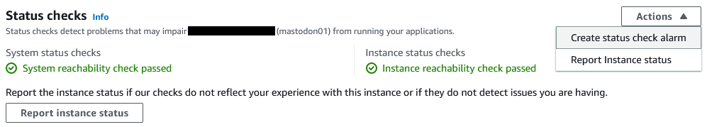

It is up to you how much monitoring you want to set up for your personal Mastodon server, if any. You are the only user 
so if it goes down no one else will be affected. But I think some basic monitoring is important and very easy to set up.

# Alarm on EC2 Instance Status

EC2 provides an easy way to make an alarm on the status checks for your instances.



Go to your instance in the AWS EC2 console. Click the "Status checks" tab and then in the "Actions" dropdown click on
"Create status check alarm".

Most of the defaults should be fine, but you can customize as you want. I changed the consecutive periods to alarm on
from 1 to 3 to make the alarm a little less sensitive. I am ok with the tradeoff of potential short downtimes for a less
noisy alarm.

# Install the CloudWatch Agent

EC2 instances come with some CloudWatch metrics by default that EC2 can measure from the hardware like CPU and network 
usage. But to get a more complete picture you need something running on the instance to collect metrics from the OS like
memory and disk usage. AWS provides a CloudWatch agent you can install to automatically collect these additional metrics
and upload them into CloudWatch.

Follow the [AWS CloudWatch Documentation][Download CWAgent] to get the agent and install it. Using a package 
manager is not an option because it is only available in Yum for Amazon Linux. Ubuntu requires Downloading and 
installing it.

## Configure the CloudWatch Agent

You need to create an IAM role for the CloudWatch agent to use. Follow the instructions in the 
[AWS CloudWatch Documentation][Create Role For CWAgent] to create the role. Be sure to follow the instruction to create
a role for an agent running in EC2 and do not create a user for on-premises servers. Attach this new role to your EC2 
instance using the EC2 console. Go to your instance and use the Actions drop down to select Security > Modify IAM Role.

You can either create a configuration file for the CloudWatch agent by hand or use the built-in wizard. I recommend
using the wizard unless you are familiar with configuring the agent already.

Start the wizard with this command:

```shell
sudo /opt/aws/amazon-cloudwatch-agent/bin/amazon-cloudwatch-agent-config-wizard
```

Go through the options and select the defaults or configure as you desire. This is how I configured it for me:

```shell
================================================================
= Welcome to the Amazon CloudWatch Agent Configuration Manager =
=                                                              =
= CloudWatch Agent allows you to collect metrics and logs from =
= your host and send them to CloudWatch. Additional CloudWatch =
= charges may apply.                                           =
================================================================
On which OS are you planning to use the agent?
1. linux
2. windows
3. darwin
default choice: [1]:

Trying to fetch the default region based on ec2 metadata...
Are you using EC2 or On-Premises hosts?
1. EC2
2. On-Premises
default choice: [1]:

Which user are you planning to run the agent?
1. root
2. cwagent
3. others
default choice: [1]:

Do you want to turn on StatsD daemon?
1. yes
2. no
default choice: [1]:
2
Do you want to monitor metrics from CollectD? WARNING: CollectD must be installed or the Agent will fail to start
1. yes
2. no
default choice: [1]:
2
Do you want to monitor any host metrics? e.g. CPU, memory, etc.
1. yes
2. no
default choice: [1]:

Do you want to monitor cpu metrics per core?
1. yes
2. no
default choice: [1]:

Do you want to add ec2 dimensions (ImageId, InstanceId, InstanceType, AutoScalingGroupName) into all of your metrics if the info is available?
1. yes
2. no
default choice: [1]:

Do you want to aggregate ec2 dimensions (InstanceId)?
1. yes
2. no
default choice: [1]:

Would you like to collect your metrics at high resolution (sub-minute resolution)? This enables sub-minute resolution for all metrics, but you can customize for specific metrics in the output json file.
1. 1s
2. 10s
3. 30s
4. 60s
default choice: [4]:

Which default metrics config do you want?
1. Basic
2. Standard
3. Advanced
4. None
default choice: [1]:
2
Current config as follows:
{
        "agent": {
                "metrics_collection_interval": 60,
                "run_as_user": "root"
        },
        "metrics": {
                "aggregation_dimensions": [
                        [
                                "InstanceId"
                        ]
                ],
                "append_dimensions": {
                        "AutoScalingGroupName": "${aws:AutoScalingGroupName}",
                        "ImageId": "${aws:ImageId}",
                        "InstanceId": "${aws:InstanceId}",
                        "InstanceType": "${aws:InstanceType}"
                },
                "metrics_collected": {
                        "cpu": {
                                "measurement": [
                                        "cpu_usage_idle",
                                        "cpu_usage_iowait",
                                        "cpu_usage_user",
                                        "cpu_usage_system"
                                ],
                                "metrics_collection_interval": 60,
                                "resources": [
                                        "*"
                                ],
                                "totalcpu": false
                        },
                        "disk": {
                                "measurement": [
                                        "used_percent",
                                        "inodes_free"
                                ],
                                "metrics_collection_interval": 60,
                                "resources": [
                                        "*"
                                ]
                        },
                        "diskio": {
                                "measurement": [
                                        "io_time"
                                ],
                                "metrics_collection_interval": 60,
                                "resources": [
                                        "*"
                                ]
                        },
                        "mem": {
                                "measurement": [
                                        "mem_used_percent"
                                ],
                                "metrics_collection_interval": 60
                        },
                        "swap": {
                                "measurement": [
                                        "swap_used_percent"
                                ],
                                "metrics_collection_interval": 60
                        }
                }
        }
}
Are you satisfied with the above config? Note: it can be manually customized after the wizard completes to add additional items.
1. yes
2. no
default choice: [1]:

Do you have any existing CloudWatch Log Agent (http://docs.aws.amazon.com/AmazonCloudWatch/latest/logs/AgentReference.html) configuration file to import for migration?
1. yes
2. no
default choice: [2]:

Do you want to monitor any log files?
1. yes
2. no
default choice: [1]:
2
Saved config file to /opt/aws/amazon-cloudwatch-agent/bin/config.json successfully.
Current config as follows:
{
        "agent": {
                "metrics_collection_interval": 60,
                "run_as_user": "root"
        },
        "metrics": {
                "aggregation_dimensions": [
                        [
                                "InstanceId"
                        ]
                ],
                "append_dimensions": {
                        "AutoScalingGroupName": "${aws:AutoScalingGroupName}",
                        "ImageId": "${aws:ImageId}",
                        "InstanceId": "${aws:InstanceId}",
                        "InstanceType": "${aws:InstanceType}"
                },
                "metrics_collected": {
                        "cpu": {
                                "measurement": [
                                        "cpu_usage_idle",
                                        "cpu_usage_iowait",
                                        "cpu_usage_user",
                                        "cpu_usage_system"
                                ],
                                "metrics_collection_interval": 60,
                                "resources": [
                                        "*"
                                ],
                                "totalcpu": false
                        },
                        "disk": {
                                "measurement": [
                                        "used_percent",
                                        "inodes_free"
                                ],
                                "metrics_collection_interval": 60,
                                "resources": [
                                        "*"
                                ]
                        },
                        "diskio": {
                                "measurement": [
                                        "io_time"
                                ],
                                "metrics_collection_interval": 60,
                                "resources": [
                                        "*"
                                ]
                        },
                        "mem": {
                                "measurement": [
                                        "mem_used_percent"
                                ],
                                "metrics_collection_interval": 60
                        },
                        "swap": {
                                "measurement": [
                                        "swap_used_percent"
                                ],
                                "metrics_collection_interval": 60
                        }
                }
        }
}
Please check the above content of the config.
The config file is also located at /opt/aws/amazon-cloudwatch-agent/bin/config.json.
Edit it manually if needed.
Do you want to store the config in the SSM parameter store?
1. yes
2. no
default choice: [1]:
2
Program exits now.
```

I ran into an issue where the swap metric was causing a lot of warnings to be logged, so I removed it because I wasn't
using it. Consider removing any metrics you don't have a use for. The free tier only covers a small number of metrics
and each additional metric is expensive.

## Start the CloudWatch Agent

Start the CloudWatch agent with the following command that specifies to use the new config generated by the wizard:

```shell
sudo /opt/aws/amazon-cloudwatch-agent/bin/amazon-cloudwatch-agent-ctl -a fetch-config -s -m ec2 -c file:/opt/aws/amazon-cloudwatch-agent/bin/config.json
```

# Create a Mastodon Dashboard

A CloudWatch dashboard is an easy way to start monitoring your server.

I recommend adding charts for disk usage and memory usage. You might also want to monitor your CPU credit balance and
usage if using a burstable instance.


When graphing CPU credit usage remember that the metric is not available with a 1-minute period. If you want to graph
as a rate (usage per minute) add a metric expression to divide by 5. Use the average statistic for a rate so if the 
dashboard period is changed it will still show usage per minute. Use the sum statistic if you want to see the total
usage during each period instead of viewing it as a rate.

Add a horizontal line to monitor if your instance is staying under the baseline CPU utilization. See the 
[Burstable Credit Table] to see what value to use for your instance. 

# Store Logs in CloudWatch

The CloudWatch agent can upload logs to CloudWatch to make it easier to view logs and troubleshoot issues.

## Upload Syslog

Get started uploading logs with /var/log/syslog. This contains Mastodon logs in addition to the important system 
logging.

Add the following section after the metrics section in your CloudWatch agent configuration file:

```json
{
  "agent": {...},
  "metrics": {...},
  "logs": {
    "logs_collected": {
      "files": {
        "collect_list": [
          {
            "file_path": "/var/log/syslog*",
            "log_group_name": "/var/log/syslog",
            "log_stream_name": "{instance_id}/syslog"
          }
        ]
      }
    }
  }
}
```

Restart the agent with the previously used command to fetch the updated configuration.

See the documentation for more information on [CloudWatch Agent Logs Configuration].

## Upload Additional Logs

Some additional log files you might consider uploading include:
* fail2ban logs - use file name "/var/log/fail2ban.log*"
* Authentication logs - use file name "/var/log/auth.log*"
* nginx access logs - use file name "/var/log/nginx/access.log*"
* nginx error logs - use file name "/var/log/nginx/error.log*"
* CloudWatch agent logs - use file name "/opt/aws/amazon-cloudwatch-agent/logs/amazon-cloudwatch-agent.log*"

# Enable Additional Metrics from Mastodon

Mastodon can output additional metrics to statsd which the CloudWatch agent can collect. Keep in mind that metrics in 
CloudWatch can be very expensive, so I don't recommend having this running all the time. Mastodon will output hundreds 
of metrics and each metric has a significant monthly cost. It can be helpful to enable these metrics temporarily to 
troubleshoot an issue, so it's good to know how to enable it. 

Pricing can always change and is regional, so check the AWS pricing page for the cost per metric. But for a reference 
point, I enabled the statsd metrics for just a few hours in us-west-2 and got a bill for . 
I estimate this would be about  per month which is not viable considering my costs are less 
than  for everything else related to running Mastodon.

## Turn On statsd Collection in CloudWatch Agent

Follow the documentation to [Enable CloudWatch statsd]. You should be able to just add `"statsd": {}` to the 
"metrics_collected" section to use all default values.

## Enable Mastodon statsd Output

Add `STATSD_ADDR=localhost:8125` to your .env.production file. Restart all the Mastodon services.

[Download CWAgent]: https://docs.aws.amazon.com/AmazonCloudWatch/latest/monitoring/download-cloudwatch-agent-commandline.html
[Create Role For CWAgent]: https://docs.aws.amazon.com/AmazonCloudWatch/latest/monitoring/create-iam-roles-for-cloudwatch-agent-commandline.html
[Burstable Credit Table]: https://docs.aws.amazon.com/AWSEC2/latest/UserGuide/burstable-credits-baseline-concepts.html#burstable-performance-instances-credit-table
[CloudWatch Agent Logs Configuration]: https://docs.aws.amazon.com/AmazonCloudWatch/latest/monitoring/CloudWatch-Agent-Configuration-File-Details.html#CloudWatch-Agent-Configuration-File-Logssection
[Enable CloudWatch statsd]: https://docs.aws.amazon.com/AmazonCloudWatch/latest/monitoring/CloudWatch-Agent-custom-metrics-statsd.html
