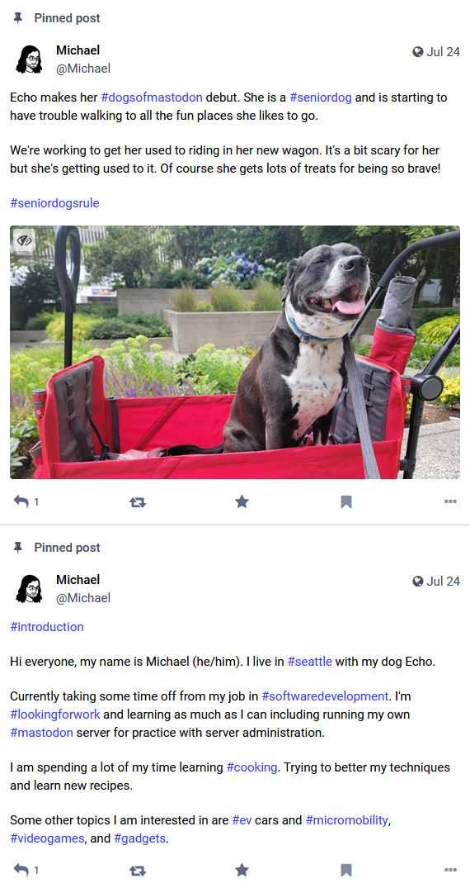
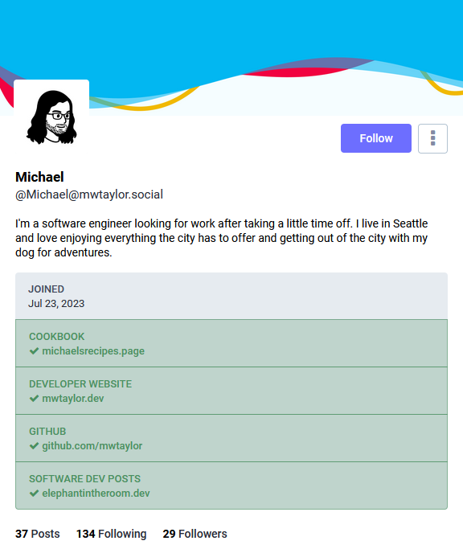
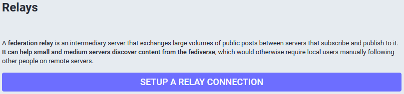

At this point in the series on setting up a personal Mastodon server you should have your server setup and running.

You are excited to get started reading posts from other users and sharing your thoughts with the world. But you open
the home page of your server and it's empty. You were promised that Mastodon servers all federate with each other. 
What's going on? It's a bit complicated and takes a bit of work to get federation going.

# How Does Federation Work?

There is not one central authority of all Mastodon servers in existence. The point of Mastodon is to be decentralized
without a single entity controlling information. This means you can't just "turn on" federation and get going.

So how do Mastodon servers learn about each other? The simple answer is by users following users on other servers. When
you follow a user your server sends a request to the other server to establish a link. Now the other server knows about 
your server and will send all new posts from the user you followed over for you to read.

It's not actually that simple, but is enough to know to move forward with the rest of this post to get started. At the
end will be a deeper dive into federation and some gotchas to keep in mind.

# Getting Started On Your New Server

My recommendation to get federated is actually to just start posting. You aren't federated with any other servers yet 
and your posts won't be sent anywhere, but it establishes a bit about who you are so other users can decide to follow 
you later. Just keep in mind that you should not post more than 5 posts at this point, more on that later.

## What should you post? 

A common way among Mastodon users to get started is to post an introduction about yourself. For your first post write a 
short bit about yourself and your interests. Potentially include some hashtags related to content you intend to post 
about or want to read. Include the hashtag #introduction in your post. This helps everyone discover new interesting 
people to follow by following the #introduction hashtag.

You can write a few other posts that give other users a feeling for what you will continue to post about moving forward.
Pet pictures are always popular on Mastodon, just be sure to include the relevant hashtag #DogsOfMastodon or 
#CatsOfMastodon.

Each post you write at this point should be pinned on your profile. This is why to not post more than 5 posts because
that is the limit of pinned posts you can have. This is important because only pinned posts are sent to other servers
to start. Once one user on a server follows you then all subsequent users following you from the same server will see
all your posts that were posted after the time of the first follow.

Learn more about [discoverability] in the Mastodon documentation.

## Fill Out Your Profile

Also be sure to fill out all the other details on your profile. See the [Mastodon documentation][Profile Setup] for all 
you can set up. The bio may be similar to the content of your #introduction post but go ahead and write both.

A good profile picture and header banner are important to really make your profile stand out.

# Find Other Users To Follow

Finding other users to follow can be a challenge because their posts are not being sent to your server. Here's a few 
ways to start following users.

## Users You Know From Other Services

If there are blogs or other sources of content you read and the author has linked a Mastodon profile then you can follow
them. Take note of both their username, and the server they are on. For example take a look at my Mastodon link on the 
left that links to [https://mwtaylor.social/@Michael][My Profile]. My username is *@Michael* and 
the server I am on is *mwtaylor.social*. Go to your server and use the search. Either copy in the link to their user
or search for @username@server (example *@Michael@mwtaylor.social*). 

Now you can view their profile and follow them. Remember that you will only see their pinned posts and posts they made
after you start following them.

## Finding Other Users

A good way to start finding other interesting users to follow is to browse on [mastodon.social Explore]. This shows 
posts from all the users that are known to the largest Mastodon server that have been getting a lot of favorites or 
boosts.

When you find a user you want to follow copy the link for the user and search for it on your server.

## Getting Follows Back

Hopefully some of the users you follow will see your profile and pinned posts and decide to follow you back. This will
start sending your posts to that users server which will further increase the chances of someone else discovering you
and following you.

# Revisiting How Federation Works

Now that you have a little experience with getting federation going let's dive deeper into what's actually going on.
This should help you better understand some of the behaviors you experienced in the previous sections.

## How Are Posts Stored Across Servers?

It's important to understand how posts are stored. This will serve as a base for everything else federation related.

Each Mastodon server stores a copy of all posts it knows about. Posting on your server will store the original copy in
your server's database. Then your server will send a copy of your post to each Mastodon server that has at least one 
user following you. When you view someone else's post from another server you are actually viewing the local copy your 
server has stored. To see the original copy you will need to view it directly on that user's server.

Some things to note from how this storage works. Your posts will not be copied to all Mastodon servers, and not even
necessarily all the Mastodon servers federated with your server. This is why a user on a server with no other users 
following you will not see your older posts. Pinned posts are handled specially which is why they are important. When 
someone is looking at your profile on another server then that server will request and store your pinned posts.

### What About Images?

Images are basically the same as posts but with one important distinction. They are copied on to all servers that know
about the related post. This can make your storage very expensive. So Mastodon has a server administration tool to 
remove images after a certain amount of time. It will only remove images from other servers, so your original images 
will be safe. Don't worry though, you can still go back and view these old posts with their images. Mastodon will fetch
the image again if it is needed.

[Check the tootctl documentation for details][Tootctl Media Remove].

## Favorites, Boosts, and Replies

A post you see on your server probably won't have accurate counts for favorites, boosts, and replies. Servers don't
broadcast all of these events to all other servers so your server won't know about most of these events. To see the most
accurate count view the post on the original server or a large server like mastodon.social.

You should be able to see most of the replies, especially after you have been using your server for a while and have a
large federation network. Unfortunately though the only way to be sure you see all the replies is go to the original
server.

It is possible to favorite, boost, bookmark, or reply to a post that your server doesn't know about. Go to the post on
the original server. Copy the link and paste it into the search box on your server. This will force your server to 
retrieve the post and store it in your database, then you can interact with it.

## Following Hashtags

Mastodon has a feature to follow hashtags you are interested in. But it doesn't work the same as following users and 
this makes it not as useful of a feature on a single user Mastodon server.

When your server generates your feed using a followed hashtag it only filters the posts known to your server with that 
hashtag. It does not search on any other servers for the hashtag. Also, other servers do not federate posts based on
hashtag following like they do for user following.

The result of this is following a hashtag will only show you posts you would have seen anyway. 

# Mastodon Relays

Mastodon supports using relays as a way to get more content to your server that it otherwise wouldn't have. They are 
configured in the administration section of your server. I haven't used one but if you choose to you will have to 
research the pros and cons of it. Relays can send a lot of information to your server and overwhelm cheap hardware. It
may also increase the amount of moderation work you have to do.

[My Profile]: https://mwtaylor.social/@Michael
[Profile Setup]: https://docs.joinmastodon.org/user/profile/
[Discoverability]: https://docs.joinmastodon.org/user/discoverability/
[mastodon.social Explore]: https://mastodon.social/explore
[Tootctl Media Remove]: https://docs.joinmastodon.org/admin/tootctl/#media-remove
